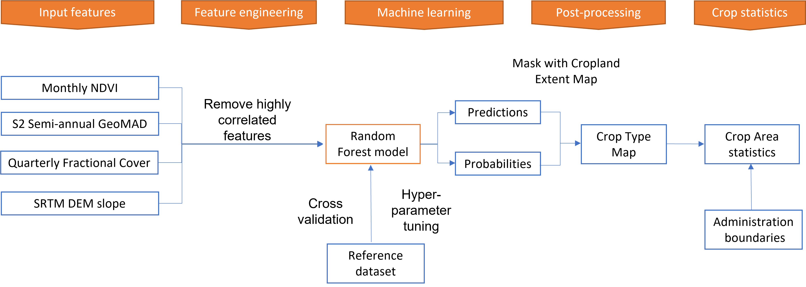

# FAO EOSTAT training: use of EO data to compute crop acreage.

Earth Observations (EO) data has been early recognized by the UN Statistical as key source of Big Data that can be used as an integration and/or alternative to traditional statistical methods to produce official statistics and report on SDG. EO data are a key data source to support the modernization of national statistical systems lead and promoted by the UN Statistical Commission. In particular, EO data can be used to produce land cover statistics and land use statistics (crop acreage and yield) that are accurate, timely and granular. 

Neverthless, despite the advances in technology, the unprecedented abundance of free and open EO data, and the availability of extensive machine learnign and AI libraries, the uptake of EO data within operational contexts in countries is still low due to a series of technical and administrative barriers. The most commonly found issues are the scarcity of in situ data of adequality quality, the complexity of satellite image pre-processing and the laborious production of Analysis Ready Data also known as datacubes. As a result, only few countries in the world produce their national land cover on a regular basis and validate results, and even fewer produce national crop type maps and keep these uptodate seasonally or even annually. As a result, the potential of EO data to quantify crop acreage and yield and modernize the approach usef for national statistics remains untapped.

In this context, FAO has launched the EOSTAT project in 2019 to unlock such potential, by building technical capacity in National Statistics Offices in countries and line Minisries concerned with land cover and crop statistics. 

Under the framework of the EOSTAT FAO has deveoped a sereis of Jupyter Notebooks for training purpose. In this context FAO and Digital Africa have jointly developed this workflow to compute crop type maps using Sentinel-2 data available from the DE Africa platform. The scripts are designed to operate in the [Digital Earth Africa sandbox](https://sandbox.digitalearth.africa/) and to be used by self paced users and for the participants to one of the several EOSTAT Webinars. The calendar is available at https://www.fao.org/statistics/statistical-capacity-development/en/?hdhd

General support on using DE Africa platform is available through the [DE Africa Help Desk](https://docs.digitalearthafrica.org/en/latest/about/contact.html).

## Crop type mapping

The crop type mapping workflow implements a supervised machine learning (ML) approach with the following main components:

* Training data cleaning and inspection
* Extraction of input features and feature engineering
* Building a ML classifier
* Generation of a crop type map

Each of these components can be tuned and refined based on type of training data available and the climate and cropping characteristics of the region of interest.

## Training sessions

The first training session explores how to inspect and clean the training data for building a machine learning model using Earth observations.

1. [Training data inspection](../1_Training_data_inspection.ipynb) - inspection of crop labels and preprocessing of training labels
2. [Phenology exploration](../2_Phenology_exploration.ipynb) - inspection of NDVI phenology curves for different crop classes
3. [Training feature extraction](../3_Training_feature_extraction.ipynb) - extraction of relevant EO measurements over training data locations
4. [Feature selection](../4_Training_feature_selection.ipynb) - inspection of training features for correlation and selection of features

The second training session covers how to use the training data and Earth observations from the DE Africa platform to build a machine learning model, and apply it to produce a crop type map.

5. [Fit, optimise and evaluate classifier](../5_Fit_classifier.ipynb) - model fitting and cross validation
6. [Model prediction and post-processing](../6_Create_test_map.ipynb) - generation of test maps over a small areas for visual inspection
7. [Country-wide crop type map](../7_Create_country_map.ipynb) - generation of a country-wide crop type map
8. [Crop area statistics](../8_Calculate_crop_statistics.ipynb) - generation of crop area statistics
